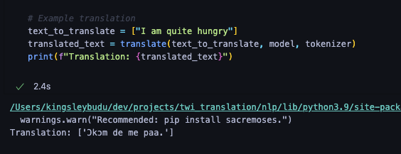
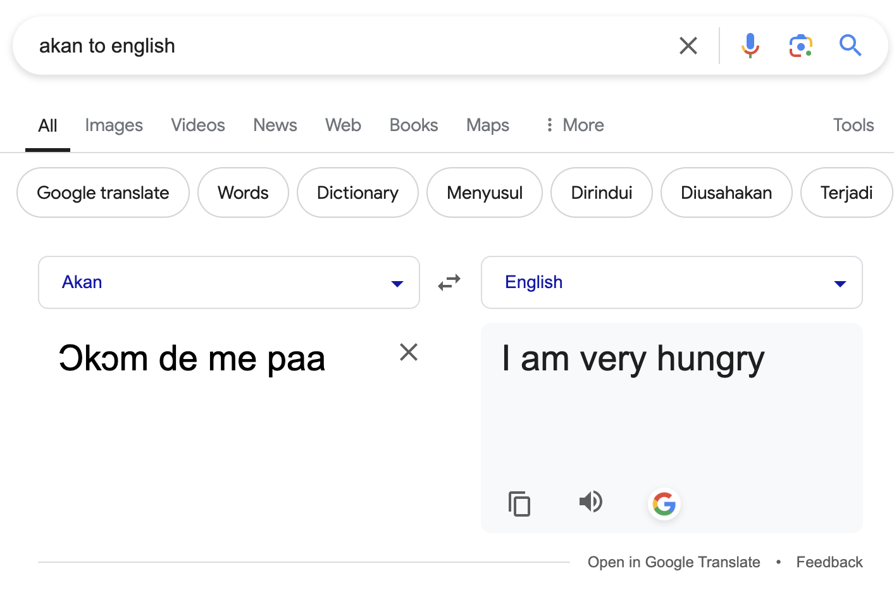

# English to Twi Translation Model

## Project Overview
This project focuses on building a translation model that translates English sentences into Twi, a native language of Ghana. By leveraging a pretrained Hugging Face model and fine-tuning it on a custom dataset of English-to-Twi sentence pairs, the project aims to create an effective and efficient machine translation system for this language pair.

The model is fine-tuned using `MarianMTModel`, a transformer-based architecture optimized for machine translation tasks.

## Model Ouput vs. Google Translate

### Model Output


### Google Translate


## Project Structure
The project is structured as follows:

- Data Preparation: The data used for this task comes from Zenodo and contains over 20,000 English words and their corresponding translations in Twi.

- Model Fine-Tuning: MarianMTModel was selected as the base model due to its efficiency in multilingual translation tasks. The pretrained model was fine-tuned on the English-Twi dataset to specialize in translating between these two languages.

- Translation Function: A translate function was implemented to allow users to input English sentences and get their Twi translations. This function tokenizes the input text, generates a translation using the fine-tuned model, and decodes the output.

- Evaluation: The model’s performance was evaluated on the validation set, and adjustments were made to improve translation accuracy.

## Requirements
To run the project, you will need the following dependencies:

- Python 3.6+
- PyTorch
- Hugging Face Transformers
- Pandas
- Datasets (Hugging Face)
- Zenodo (for dataset access)

You can install the necessary libraries using the following command:

```bash
pip install torch transformers datasets pandas
```

## Dataset
The dataset used in this project contains over 25,000 English-Twi sentence pairs. However, due to computational limitations, I used a subset of 5,000 pairs for the fine-tuning process. The dataset was sourced from Zenodo, and it is publicly available for anyone who wants to explore it further.

## Training
The model was fine-tuned using a subset of the dataset to reduce training time while still maintaining translation quality. The fine-tuning process involved:

- Tokenizing the input English and Twi sentences.
- Training the MarianMTModel on these tokenized sentence pairs.
- Evaluating the model on a validation set to monitor performance and fine-tune hyperparameters.
Usage

Once the model is trained, you can use the translate function to translate English sentences into Twi. Example usage:

```python
text_to_translate = ["How are you?"]
translated_text = translate(text_to_translate, model, tokenizer)
print(f"Translation: {translated_text}")
```

This function tokenizes the input sentence, generates the translation using the fine-tuned model, and returns the Twi translation.

## Model Training Performance

The model was trained on 20366 sentences dataset for 2 epochs. Below is the performance during training and evaluation:

- Training time: 4 hours 2 minutes
- Training steps: 5084 steps
- Training loss: 0.3759

## Evaluation Metrics:

- Evaluation loss: 0.2789
- Evaluation runtime: 188.5866 seconds
- Evaluation samples per second: 13.479
- Evaluation steps per second: 1.686

## Conclusion
This project demonstrates how a pretrained model like MarianMTModel can be fine-tuned to handle a low-resource language translation task like English to Twi. By utilizing an existing model architecture and focusing on the nuances of the target language pair, this project provides a foundation for further developments in multilingual and low-resource language translations.

## Future Work
Expanding the dataset beyond the current subset to improve translation accuracy.
Testing the model on longer and more complex sentences.
Exploring other models or architectures that might improve the quality of translation for low-resource languages like Twi.

## Acknowledgments
- Hugging Face for providing accessible pretrained models.
- Zenodo for the dataset used in this project.